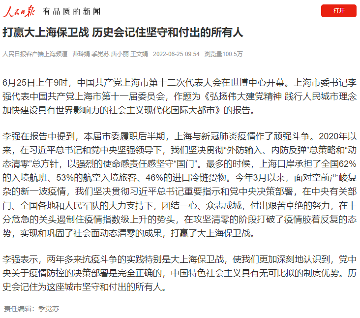

# 6-25

#### 人民日报

6月25日上午9时，中国共产党上海市第十二次代表大会在世博中心开幕。上海市委书记李强代表中国共产党上海市第十一届委员会，作题为《弘扬伟大建党精神 践行人民城市理念 加快建设具有世界影响力的社会主义现代化国际大都市》的报告。

李强在报告中提到，本届市委履职后半期，上海与新冠肺炎疫情作了顽强斗争。2020年以来，在习近平总书记和党中央坚强领导下，我们坚决贯彻“外防输入、内防反弹”总策略和“动态清零”总方针，以强烈的使命感责任感坚守“国门”。最多的时候，上海口岸承担了全国62%的入境航班、53%的航空入境旅客、46%的进口冷链货物。今年3月以来，面对空前严峻复杂的新一波疫情，我们坚决贯彻习近平总书记重要指示和党中央决策部署，在中央有关部门、全国各地和人民军队的大力支持下，团结一心、众志成城，付出艰苦卓绝的努力，在十分危急的关头遏制住疫情指数级上升的势头，在攻坚清零的阶段打破了疫情胶着反复的态势，实现和巩固了社会面动态清零的成果，打赢了大上海保卫战。

李强表示，两年多来抗疫斗争的实践特别是大上海保卫战，使我们更加深刻地认识到，党中央关于疫情防控的决策部署是完全正确的，中国特色社会主义具有无可比拟的制度优势。历史会记住为这座城市坚守和付出的所有人。

